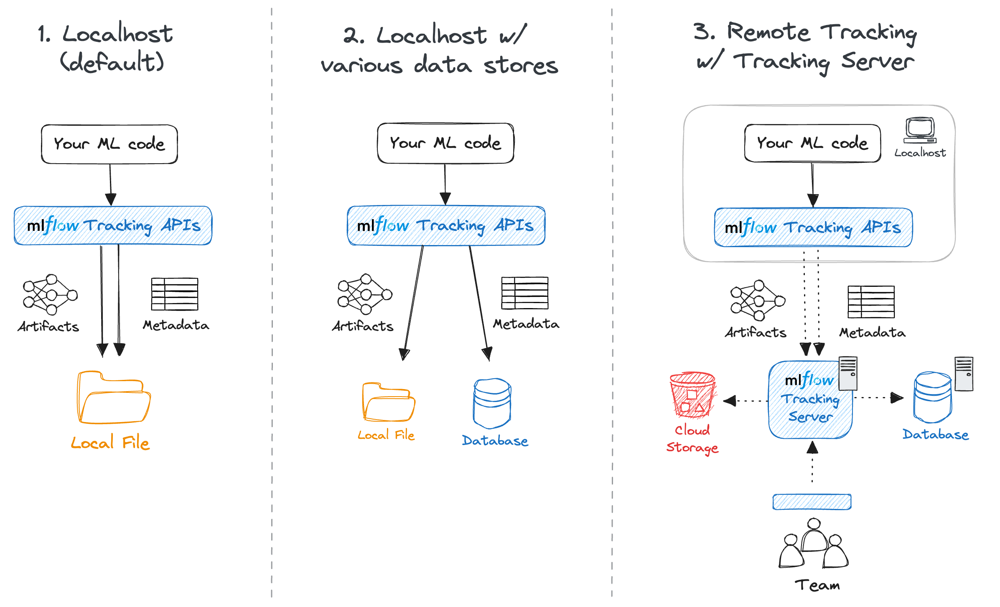

# Practical Agent Ops: From PoC to Prod with MLflow 3.0

Resources related to my upcoming training at the Open Data Science Conference (ODSC AI) East 2026 in Boston on April 28th, 3:30 - 5:30 PM EDT, Hynes Convention Center


Getting Started [Blog Post](https://opendatascience.com/practical-agentops-getting-started-with-mlflow-3/?utm_campaign=Learning%20Posts&utm_content=371714959&utm_medium=social&utm_source=linkedin&hss_channel=lcp-9358547)

Schedule posted [here](https://schedule.odsc.ai/?_gl=1*1rp4vpd*_gcl_aw*R0NMLjE3NjcxMDIzNTQuQ2p3S0NBaUF4Y19KQmhBMkVpd0FGVnM3WEFGWFUyVHdKQ3puNS0yZ0lwWmF3dldTQkljNW53UVFJay1zbU9qdnZoa1RjRnVUMmRzVnBSb0NWS3NRQXZEX0J3RQ..*_gcl_au*MTM4MTU5NzgxNy4xNzY3MTAyMzQ2*_ga*NjczNjI3OTguMTc2NzEwMjM0NQ..*_ga_SHYQHG0XQ1*czE3NzI1Nzg4MTQkbzkkZzEkdDE3NzI1NzkxODgkajU5JGwwJGg1NDI2NTkwMjQ.)

Main Conference Page [ODSC AI East 2026](https://odsc.ai/east/)

# Architecture

We will be setting up localhost using option 2 shown here



# Prerequsites

1. VS Code Downloaded: [Download here](https://code.visualstudio.com/download)
2. Jupyter + Python extensions installed within VS Code
3. LLM API Key (Billing enabled preferred)

# Quick Start

1. Clone the repo
```bash
git clone https://github.com/jon-bown/practical-agent-ops-mlflow3.git
cd practical-agent-ops-mlflow3
```

2. Set Up `.env`
```bash

```bash
touch .env
```

Open `.env` and fill in the following variables:

```bash
GEMINI_API_KEY=your-gemini-billing-enabled-api-key
GEMINI_API_KEY_FREE=your-gemini-free-tier-api-key
OPENAI_API_KEY=your-openai-api-key
MLFLOW_TRACKING_URI=http://127.0.0.1:5000
EXPERIMENT_1_NAME=mlflow-agent-1
EXPERIMENT_2_NAME=mlflow-agent-2
EXPERIMENT_3_NAME=mlflow-agent-3
EXPERIMENT_4_NAME=mlflow-agent-4

GEMINI_OPENAI_BASE_URL=https://generativelanguage.googleapis.com/v1beta/openai/
```

# Set up the environment

Set up UV

```bash
pip install uv
```

```bash
# Make sure you're in the local folder cloned from the repo
cd practical-agent-ops-mlflow3
uv init

#Make sure you have an updated version of python installed (3.9 or higher required for MLflow)
uv python install 3.14
```

Activate the virtual environment

```
source .venv/bin/activate
```

Add packages

```
uv add ipykernel mlflow openai langchain langchain-google-genai langgraph python-dotenv
```

Sync with current environment

```bash
uv sync
```

# Select your environment in the notebook

Cmd/ctrl + P -> Python: Select Interpreter

choose 
```bash
practical-agent-ops-mlflow3 (3.14)
```

Should be the recommended option.

# Add (+) a new terminal window

# Start the MLflow server

```bash
mlflow server --backend-store-uri sqlite:///mlflow.db --host 127.0.0.1 --port 5000
```

✅ You're ready to build agents with MLflow!